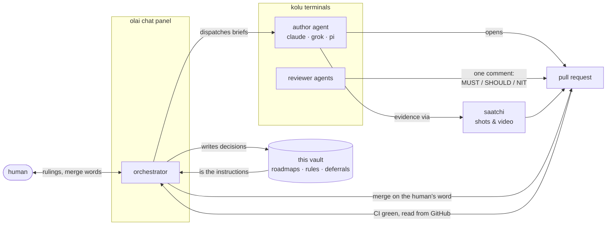

# oss.olai

The working memory of an AI agent orchestrator — the "brain" it boots from, as plain text under git.

[Olai](https://github.com/juspay/olai) serves this directory as an outliner; the orchestrator is a long-running agent living in olai's chat panel. It reads this repository at boot and knows everything the previous session knew — nothing lives only in a chat transcript.

[**Demo video**](https://x.com/sridca/status/2093354491965735091) — olai working on this very repository.

## The orchestration loop

Every lane walks the same pipeline: **implement → refactor → review → fold → CI → evidence → merge → retire**. Reviews read code (never run suites); CI verdicts come from GitHub, never from an agent's claim; evidence is photographed against real data; deferrals park in the Inbox with a link to the PR that owes them, and merge only on the human's word.

## Layout

| Path | What it is |
|---|---|
| `orchestrator/` | The rules the orchestrator re-reads every boot: discipline, agent roster, pipeline template, reminders |
| `projects/olai/` | [juspay/olai](https://github.com/juspay/olai) — roadmaps, brainstorms, RCAs, debate conclusions, UI prototypes |
| `projects/saatchi/` | [juspay/saatchi](https://github.com/juspay/saatchi) — the evidence tool's roadmap |
| `projects/kolu/` | [juspay/kolu](https://github.com/juspay/kolu) — the terminal fleet's roadmap |
| `projects/nixos-unified-template/` | [juspay/nixos-unified-template](https://github.com/juspay/nixos-unified-template) — the template's roadmap |
| `brainstorming/` | Cross-project idea documents (e.g. the design that became saatchi) |
| `_olai/` | Vault internals: property types, the Inbox (deferrals park here, each linking its source PR), trash |
| `briefs/`, `debates/` | Untracked working material |

## How it changes

The orchestrator writes only through olai's own operations — every write validated, every beat one commit; `git log` is the history, the notes carry only the current state. Extracted from `juspay/olai`'s `docs/` in August 2026 with full history.
