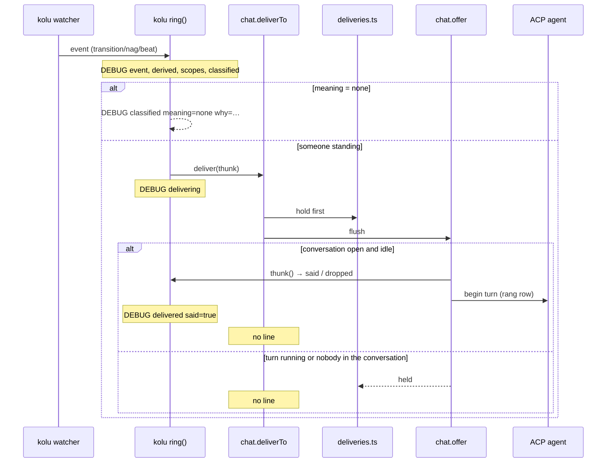
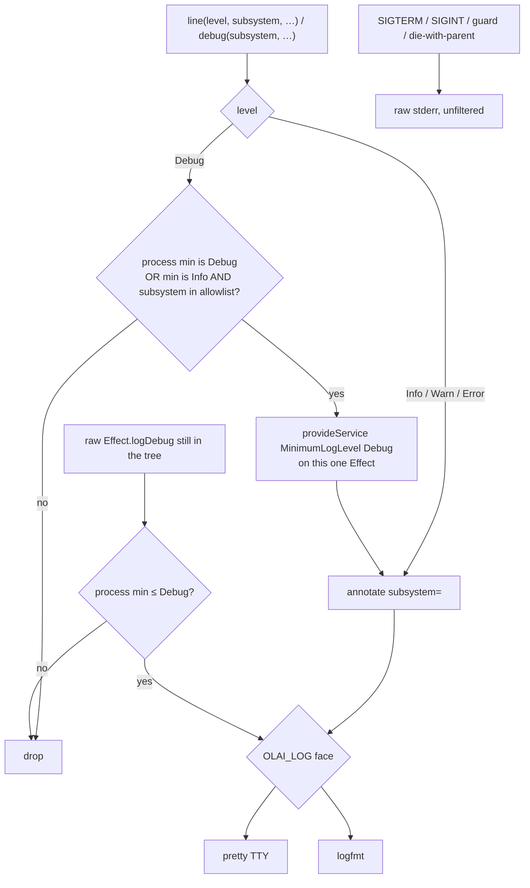
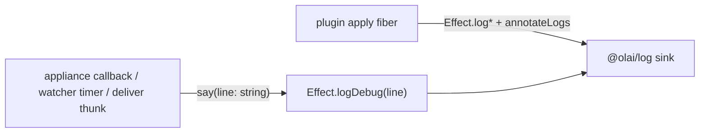

# Audit logging across the whole app — observability done right

- **Author:** (brainstorm; not a ruling)
- **Date:** 2026-09-03
- **Status:** Draft
- **Roadmap:** `logging-audit` (parent `infra-server`, tags `#needs-brainstorm #human`) in `/home/srid/code/oss.olai/projects/olai/roadmap/infra.olai`
- **Workspace audited:** `/home/srid/code/olai/.worktrees/logging-audit`

This document audits what olai actually logs, argues the options with evidence, and **recommends** a standard. Every recommendation is a proposal pending the human's ruling. The standard (structured shape, levels, per-subsystem toggles) is a decision to rule, not for an agent to invent. Open Questions at the end are the rulings.

---

## Overview

On 2026-09-01 a claimed lane silently dropped from the kolu doorbell's ringing set (`doorbell-missing-claim`, P1). Across 15,611 server log lines the journal had two watcher-adjacent messages — `"kolu is on this session"` and `"stale tab rejected"` — and nothing that named the derived set, the classification, a nag, a delivery, or the heartbeat's membership. The orchestrator reconstructed the failure from the chat transcript and `kolu ls`. The earlier `logging` node (Proper logging, marked DONE 2026-08-10) is what that "done" bought; sibling `log-pretty` is also DONE. This audit re-opens the whole question rather than trusting either mark.

PR #462 shipped the tracing that would have made that P1 a glance (`packages/plugins/kolu/src/trace.ts`, the `derived` line that **names** the ringing set). It is `Effect.logDebug`. `OLAI_LOG_LEVEL=debug` turns it on, all-or-nothing, across every subsystem (`packages/server/src/main.ts:133-137`). The logging built to diagnose a supervision failure is silent exactly when the failure happens, unless debug was already on — and turning it on costs every other subsystem's debug output, including agent stderr, which `packages/log/src/level.ts:16-17` already names as "by volume the loudest thing olai emits."

The machinery is not the problem. `@olai/log` is a real seam: Effect's verbs, two faces, one process-wide minimum, annotations, an emitter that preserves the fiber, a testlib that hears pieces rather than regexes. House rules already in force (quiet default, message-is-stable / values-are-annotations, pretty-on-TTY / logfmt-elsewhere, no logger of olai's own) should stay. What is missing is a **bar** an author can apply — which lines earn INFO because their absence is the fact, how an operator turns up **one** subsystem, and a plugin door that does not force the doorbell to hand-render logfmt into a DEBUG string. The proposal is: keep the seam, add a closed subsystem vocabulary and a second env that lifts Debug for named subsystems without moving the process minimum, restated level discipline with "silence that is a decision" called out, and a proving-ground PR that promotes the #462 doorbell moments the P1 actually needed. Nothing here is decided until the human rules the Open Questions.

---

## Background & Motivation

### Provenance

The human's suspicion, 2026-09-01, proven the same evening: logging is not a quality bar, it is a collection of local judgements that do not add up to a diagnosable process.

**The proof.** `doorbell-missing-claim` in `/home/srid/code/oss.olai/projects/olai/roadmap/bugs.olai`: a lane fully claimed on the board was invisible to the fleet doorbell — no initial wake, no nag, absent from the standing set, uncounted by the heartbeat — for 26 minutes with its agent sitting `waiting`. The journal could not tell a lane the doorbell had decided against from a lane nobody had scoped. #462 (merged 2026-09-01, `lane-dmc-ci` carries `pr-url` `https://github.com/juspay/olai/pull/462`) fixed the gate **and** added the account. Verified against the deployed serve the same evening at 19:45: the account is on DEBUG, so a normally-running serve still cannot diagnose the next one of this shape.

**What "Proper logging" actually shipped.** `@olai/log` as the seam, Effect verbs, `OLAI_LOG` / `OLAI_LOG_LEVEL` split, pretty vs logfmt, `prettyCause` / `reasonOf`, the callback emitter, the testlib. Chat lifecycle at INFO (`chat agent spawned/exited`, `conversation opened`, `prompt sent`, `turn ended/failed`, `message queued`). Failed-turn stderr promoted to WARN (the 2026-08-22 silent-send). Surface events through `report.ts`. Git refusals at WARN. That is a format and a handful of lifecycle lines. It is not coverage of decisions whose failure mode is **a call that does not happen**.

### Current machinery (verified)

`packages/log` owns sinks, level, cause rendering, the callback emitter, and the testlib. Callers import nothing from it for the verbs — they `Effect.log*`. The composition root provides `atLevel()` innermost on the `web` handler when `OLAI_LOG_LEVEL` is set (`packages/server/src/main.ts:131-134`) and `toStdout` on the `runMain` layer (`main.ts:390-392`). The comment at `main.ts:366-368` is the same fact, not a second provide.

| file | what it owns |
|---|---|
| `packages/log/src/sinks.ts` | pretty on a TTY, logfmt elsewhere; `OLAI_LOG` forces either |
| `packages/log/src/level.ts` | `OLAI_LOG_LEVEL`, default info, env wins over `--log-level` |
| `packages/log/src/cause.ts` | `prettyCause` for a log, `reasonOf` for a sentence, `codeOf` for errno |
| `packages/log/src/emit.ts` | capture fiber services once, run callback lines under them |
| `packages/log/src/lines.testlib.ts` | `collector` / `findSaid` inside the process; `findLogfmt` outside it |

House rules already in force, **not reopened unless the evidence demands it**:

1. Quiet by default (Info). Debug off until asked.
2. Message is a short stable sentence; varying values are annotations (`url=`, `root=`, `agent=`).
3. Two faces, two variables: `OLAI_LOG` picks the face, `OLAI_LOG_LEVEL` picks quietness.
4. No logger of olai's own — Effect's verbs.
5. Plugins' `apply` is a fiber now (`packages/plugin-api/src/services.ts:53-65` retired the `Log` service), so a plugin **can** `Effect.log*` and `annotateLogs` from `apply`. What still cannot annotate is everything that is **not** an Effect: appliance callbacks, doorbell thunks, watcher timers. Those still get `(line: string) => void` mapped to `Effect.logDebug(line)` / `Effect.logWarning(line)`.

### The door-narrowing, named

`packages/plugins/kolu/src/trace.ts:18-25` is explicit: the doorbell hand-renders logfmt because `PluginServices.say` used to be `(line: string) => void`, and widening that door is "the real fix" and "a change to core's plugin contract." The `Log` service is gone; the remaining string door is the appliance's `say`/`warn` and the tracer closed over `run(Effect.logDebug(line))` (`packages/plugins/kolu/src/server.ts:318-366`). A DEBUG line therefore looks like:

```
timestamp=… level=DEBUG fiber=#N message="kolu doorbell derived file=lanes.olai claims=9 ringing=11e565c0@task-notification-spill,…"
```

`file=`, `ringing=`, `terminal=` live **inside the message**, not as Effect annotations. `findLogfmt` matches `message` exactly (`packages/log/src/lines.testlib.ts:116-144`), so those facts are not greppable the way `url=` on `serving` is. That is the cost of the door, still being paid after the service that caused it was deleted.

### Why a logger-side filter cannot resurrect Debug

Effect checks `References.MinimumLogLevel` **before** a logger sees the event. A custom `Logger.make` that inspects `subsystem=` and lets doorbell Debug through will never see those lines if the process minimum is Info. This is load-bearing for the toggle design: per-subsystem Debug is a **call-site / fiber-local** problem, not a sink filter. Option analysis in Proposed Design.

---

## Goals & Non-Goals

### Goals

- A **diagnosable journal**: a fault in any audited subsystem is reconstructable from logs alone, without a live repro and without reading a chat transcript.
- A **bar**, not a vibe: DEBUG / INFO / WARN / ERROR with "silence that is a decision" named as the failure mode this audit exists for.
- A way for an operator to turn up **one** subsystem (doorbell tracing without agent stderr).
- Structured fields that survive the plugin/appliance boundary, so `grep ringing=` and `grep subsystem=doorbell` are the same kind of grep.
- Incremental PRs, independently reviewable. The doorbell is the proving ground because #462 already has the moments.

### Non-Goals

- Replacing Effect's verbs with a logger of olai's own.
- Changing the two faces (`OLAI_LOG`) or collapsing them onto `OLAI_LOG_LEVEL`.
- Shipping client logs to the server, or building an ErrorBoundary logging pipeline. The browser console is a different reader (see §12).
- Logging agent transcripts, prompt text, identity header values, or bearer tokens.
- A metrics/tracing backend. This is the journal.
- Making every debug line an info line. Volume is a first-class constraint.
- Live reconfiguration of a running systemd unit in PR 1. Restart is the first answer; SIGHUP is an Open Question.

---

## Audit

Coverage key: **yes** = a later reader can answer "why did X happen (or not)" from the journal without a repro. **partial** = a line exists but the level, fields, or the silent arm make the answer incomplete. **no** = the decision or failure is invisible.

Levels cited are what the call site actually uses today.

### 1. serve / lifecycle

Boot is one `Effect.withLogSpan("serve")` (`packages/server/src/serve.ts:625`). `root=` is annotated on the serve fiber **before** plugins mount (`serve.ts:124`), so every later line inherits it — including plugin lines, which is why this annotation sits where it does.

| Decision / failure | Line exists? | Level | Fields | Diagnosable? | Cite |
|---|---|---|---|---|---|
| SIGTERM guard armed | yes (raw stderr, not Effect) | n/a | pid of supervisor | yes | `packages/sigterm/src/sigterm.ts:494-496` |
| SIGTERM guard unavailable | yes (raw stderr) | n/a | reason | yes | `sigterm.ts:501-503` |
| SIGTERM honored / refused | yes (raw stderr) | n/a | pid, uid, cmdline | yes | `sigterm.ts:538-549` |
| SIGTERM flood dropped records | yes (raw stderr) | n/a | count | yes | `sigterm.ts:441-443` |
| SIGINT / SIGTERM received | yes (raw stderr) | n/a | signal name | yes | `packages/server/src/main.ts:352-356` |
| Die-with-parent **failed** to arm | yes (raw stderr) | n/a | pid, reason | yes | `packages/server/src/dieWithParent.ts:169-186` (prctl non-zero), `184-187` (libc would not load); `:144` is a complaint about a bad env value |
| Die-with-parent **armed** | **no** (success is silent: `prctl` returning 0 just `return`s) | — | — | **partial** (a later SIGTERM from the dying parent is the evidence) | `dieWithParent.ts:163-179` |
| Swept leftover runtime files | yes | INFO | `count` | yes | `packages/server/src/lock.ts:319-321` |
| Pruned gone state records | yes (only if count > 0) | INFO | `count` | yes | `lock.ts:384-387` |
| Vault in use | CLI error, process does not serve | n/a | pid, root | yes (stderr of the **refused** process; the running one says nothing about a challenger) | `lock.ts:337`, `docs/running.md:28-37` |
| Lock unavailable | CLI error | n/a | path, reason | yes | `lock.ts:340` |
| Port in use, serving elsewhere | yes | INFO | `asked`, `url` | yes | `packages/server/src/listener.ts:123-126` |
| Bound off loopback | yes | WARN | `host` | yes | `serve.ts:597-603` |
| Serving | yes | INFO | `url` (+ inherited `root`, `serve=…ms`) | yes | `serve.ts:596` |
| No agent on this machine | yes | INFO | reason sentence | yes | `serve.ts:303` |
| Chat agents detected | yes | INFO | `agents` (id=command), `mcp` | yes | `serve.ts:613-621` |
| Plugin `apply` failed | **no** (quoted on the preferences row only) | — | — | **no** | `serve.ts:208-214` reads `reportBundle`; `packages/effect-cordis/src/host.ts:160-164` swallows the throw |
| Shutdown / scope unwind | only the SIG* lines | — | — | partial (signaled vs crash is distinguishable; "deliberate stop after serving" is the SIGTERM pair) | `main.ts:33-42` |

**Verdict.** Lifecycle of the **process** is the strongest subsystem in the tree, and it got that way by incident (2026-08-20 SIGTERM RCA, 2026-08-23 die-with-parent, 2026-08-29 stray pkill). The SIGTERM/SIGINT lines **bypass Effect on purpose** — a journal must see them even at `OLAI_LOG_LEVEL=error`. They are not logfmt. That exception should stay, and should be named in the standard as the one face that is allowed to be a raw stderr sentence.

The hole: a plugin that dies in `apply` lands `FAILED` with siblings untouched (`host.ts:160-164`) and the preferences row quotes the throw. The journal of a serve that booted "fine" with kolu failed is indistinguishable from a serve that never composed kolu, except by opening the ⚙ panel.

### 2. publish / subscribe loop

| Decision / failure | Line exists? | Level | Fields | Diagnosable? | Cite |
|---|---|---|---|---|---|
| Store probe failed | yes | WARN | cause (inherited `root`) | yes (the loop continues; the page freezes on last-good — documented) | `packages/store/src/store.ts:995-998` |
| Snapshot published | **no** | — | — | n/a (per-keystroke; silence is correct) | `store.ts` cycle |
| Websocket connected / disconnected | **no** (deliberate) | — | — | n/a (`report.ts:40-45`: one line per socket per reload is how a log stops being read) | `packages/server/src/report.ts:43-45` |
| Stale tab rejected | yes | INFO | `claimed` (pid) | yes | `report.ts:50-55` |
| Websocket upgrade refused (origin) | yes | WARN | `origin`, `url` | yes | `report.ts:59-65` |
| Surface socket failed | yes | WARN | `why` (prettyCause) | yes | `report.ts:67-72` |
| Surface connection failed | yes | WARN | `why` | yes | `report.ts:78-83` |
| Live stream re-read failed | yes | WARN | `stream`, `why` | yes | `report.ts:101-107` |
| Body read failed (file there, will not open) | yes | WARN | interpolated `failure.message` only — **no** `file=` annotation | partial | `packages/server/src/bodies.ts:163-166` |
| Preview file there, will not open | yes | WARN | message, **`file=`** | yes | `media.ts:362-368` (the annotation `bodies.ts` does not have) |
| Preview on a host the server will not spell | yes | WARN | `host`, `file` | yes | `media.ts:325-332` |
| File gone between listing and read | **no** (deliberate: next probe drops the key) | — | — | yes, from the page | `bodies.ts:150-154` |

**Verdict.** The wire's **faults** are covered and annotated. The ordinary publish is silent, which is the right volume call — every keystroke is a revision. Partial: there is still no INFO that the store has **never** published after boot (the doorbell's own first gate, `derived === undefined`, is only a DEBUG `dropped why=no-revision` on the kolu side). A serve whose watcher never saw a snapshot and a serve whose watcher is healthy and quiet look the same at INFO.

### 3. ops layer

| Decision / failure | Line exists? | Level | Fields | Diagnosable? | Cite |
|---|---|---|---|---|---|
| Write landed | **no** | — | — | n/a (the page / MCP reply is the record) | `@olai/ops` |
| Write refused (validation, usage, stale, …) | **no** in the journal; yes on the chat row / MCP `isError` | — | — | **partial** (the person at the panel sees it; a headless auto-commit serve does not) | `serve.ts:278-279` `onRefusal` → `chat.recordRefusal`; `packages/server/src/mcp/tools.ts:486` |
| Working tree could not be surveyed | yes | WARN | `said` (git's words) | yes | `packages/ops/src/pending.ts:741-744` |
| Could not stage | yes | WARN | `said` | yes | `packages/git/src/git.ts:869-872` |
| Write was not committed | yes | WARN | `commitMessage`, `said` | yes | `git.ts:891-894` |
| Branch was not pushed | yes | WARN | `said` | yes | `git.ts:931-934` |
| Auto-commit loop defect | yes | **ERROR** (the only `logError` in the tree) | `cause` | yes | `pending.ts:1218-1222` |
| Auto-commit succeeded | **no** | — | — | **no** (headless `--commit=auto --push=auto` records and shares with no journal line that it did) | `pending.ts:1192-1195` |
| Loop paused on refusal | **no** (runtime state, drawn as Resume) | — | — | **partial** (the WARN of the refusal is there; that the loop then **stopped** is not a line) | `docs/running.md:217-223` |
| Resume pressed | **no** | — | — | no | `pending.ts:1232-1239` |

**Verdict.** Git **refusals** learned the silent-send lesson (`said=` is git's own words, kept whole). Git **success** under auto is the headless analogue of the doorbell: a call that is supposed to happen, whose absence is the fact. One INFO per auto-commit (sha, path count) and one WARN when the loop pauses would close it. Per-write logging at INFO is rejected — that is how a log stops being read, and the panel already draws what is waiting.

### 4. ACP chat bridge

`packages/chat/README.md` already states the intended bar. Call sites mostly match it.

| Decision / failure | Line exists? | Level | Fields | Diagnosable? | Cite |
|---|---|---|---|---|---|
| Agent spawned (after handshake, not after `spawn`) | yes | INFO | `agent`, `command`, `args` | yes | `packages/chat/src/agent.ts:1305-1308` |
| Agent exited | yes | INFO | `agent`, `session`, `code`, `signal` | yes | `agent.ts:1164-1171` |
| Conversation opened | yes | INFO | `agent`, `session`, `how` (`new`/`loaded`) | yes | `agent.ts:1488` |
| Prompt sent | yes | INFO | `bytes` (never text) | yes | `agent.ts:1956-1958` |
| Turn ended | yes | INFO | `stopReason`, `duration` | yes | `agent.ts:1985-1988` |
| Turn failed | yes | WARN | `error`, `duration` + stderr dump | yes | `agent.ts:1976-1981`, `dumpStderr` at 463-471 |
| Agent stderr (live) | yes | DEBUG | the chunk, as the message | yes, if debug on; **drowns everything** | `agent.ts:461`, `1138-1140` |
| Agent stderr (failed turn) | yes | WARN | one escaped line, capped 32 KiB | yes at default | `agent.ts:463-471` |
| Message queued behind a running turn | yes | INFO | `agent`, `session` | yes | `packages/chat/src/chat.ts:2244-2248` |
| Plugin on this session | yes | INFO | `command` | yes | `packages/chat/src/probes.ts:167-169` |
| Plugin **not** on this session | yes | DEBUG | `where`, `why` | **partial** (the panel draws the same sentence; the journal is silent at default — deliberate, `probes.ts:157-163`) | `probes.ts:171-175` |
| Boot failed | yes | WARN | `agent`, message | yes | `chat.ts:3275-3277` |
| Session memory unreadable | yes | WARN | why | yes | `packages/chat/src/sessions.ts:330-333` |
| Doorbell picks unreadable | yes | WARN | why | yes | `packages/chat/src/scopes.ts:451-454` |
| Model not on picker | yes | WARN | `model` | yes | `agent.ts:1006-1009` |
| Memory write lost (teach / assign / last-said) | yes | WARN | why | yes | `chat.ts:765`, `1285`, `1336-1339`, `3219-3223` |
| Task-notification with no announced row | yes | DEBUG | — | partial | `chat.ts:1450-1452` |
| Task-notification named no spawning call or no task | yes | DEBUG | — | partial | `packages/chat/src/agent.ts:727-729` (same class, the agent's half) |
| Core `deliverTo` handed / held / dropped | **no** | — | — | **no** (the plugin traces `delivering`/`delivered` at DEBUG; core's three-arm decision is invisible) | `chat.ts:2694-2724`, `2574-2604` |
| Held-slot cap bitten (`SLOTS=32`) | **no** (deliberate: "NO ELISION LINE") | — | — | **no** | `packages/chat/src/deliveries.ts:117-119` |
| Stale session / gone | WARN via `trouble` / `turn failed` / `chat agent exited` | WARN/INFO | — | yes | `agent.ts:484-486` |

**Verdict.** Chat **lifecycle** is the other strong subsystem, and it is why the 2026-08-22 silent-send is diagnosable at default. The remaining hole is the **doorbell's other end**: core decides `handed | held | nothing` (`chat.ts:2594`) and logs none of it. A body the plugin traces as `delivering` and never `delivered` could be core holding it, coalescing it, or the thunk returning null — and the plugin's `delivered said=false` only covers the last. Promoting a single core line per actual hand-over (and a DEBUG line per hold) is the proving-ground's other half — **if Q2 puts `handed` at INFO**. Q2(iii) is toggle-only and must not smuggle that line in.

Agent stderr at DEBUG remains the volume ceiling any toggle must keep off the doorbell path.

### 5. kolu plugin

Three channels, three volumes.

**Padi link** (`packages/plugins/kolu/src/client/link.ts`) via appliance `say` → `Effect.logDebug`:

| Decision / failure | Line exists? | Level | Fields | Diagnosable? | Cite |
|---|---|---|---|---|---|
| Padi connected | yes | DEBUG | interpolated socket in the **message** | **partial** (off until debug; not an annotation) | `link.ts:296` |
| Mirror fault | yes | DEBUG | label, err | partial | `link.ts:335` |
| Link ended | yes | DEBUG | why | partial | `link.ts:344` |
| No padi | yes | DEBUG | socket, err | partial | `link.ts:412` |
| Malformed `_olai/Kolu.olai` knob | yes | WARN | the sentence | yes | `packages/plugins/kolu/src/client/index.ts:504` via `warn` |
| Probe: kolu is on this session | yes (chat) | INFO | `command` | yes | `probes.ts:167` |

**Doorbell** (`trace.ts` + `server.ts` + `doorbell.ts`), every moment `Effect.logDebug` through a hand-rendered line:

| Moment | Exists? | Level | Fields (inside message) | Diagnosable at default? | Cite |
|---|---|---|---|---|---|
| `event` (transition / nag / heartbeat) | yes | DEBUG | `kind`, `at`, `terminal`, `state` | **no** | `server.ts:480-485` |
| `derived` (named ringing set) | yes | DEBUG | `file`, `claims`, `ringing`, `unmatched`, `excluded`, `fleet` | **no** — this is the P1 line | `doorbell.ts:1164-1171` |
| `scopes` | yes | DEBUG | `terminal`, `scoped`, `files` | no | `server.ts:554-558` |
| `classified` (incl. `meaning=none` + `why`) | yes | DEBUG | `terminal`, `file`, `agent`, `session`, `meaning`, `why` | no | `server.ts:575-582` |
| `delivering` | yes | DEBUG | `file`, `meaning`, `agent`, `session`, `coalesce` | no | `server.ts:596-602` |
| `said` / `dropped` (thunk, delivery moment) | yes | DEBUG | `standing`, `terminals` / `why` | no | `server.ts:408-423` |
| `delivered` | yes | DEBUG | `said` (bool) | no | `server.ts:637-643` |
| Heartbeat `beat` / `beating` / `beat-passed` / `beat-said` / `beat-dropped` | yes | DEBUG | file, agent, why | no | `doorbell.ts:1570-1607` |
| Doorbell walk threw | yes | WARN | cause | yes | `server.ts:650-652`, `704-706` |

`docs.md:139-178` and `trace.ts:40-49` argue DEBUG **on purpose**: a doorbell narrating every event at INFO would be a running commentary, and the one line that mattered would arrive dressed as the ones a reader has learned to skip. That argument is real. It is also how the P1 stays undiagnosable on a production unit. The tension is the central Open Question, not a style disagreement.

**Volume, estimated (not measured on a live journal — this worktree is not the deployed serve).**

- Watcher `held-for` default 60s, `nag` 10m, `heartbeat` 30m (`docs/plugins/kolu.md` / `_olai/Kolu.olai`).
- Per nag, per scoped file: `event` + `derived` + `scopes` + one `classified` per seat + (`delivering`/`delivered` or silence). A day board with 4 waiting terminals and 1 scoped conversation is on the order of **~6–10 DEBUG lines per nag**, ~24–40/hour from nags alone, plus padi chatter ("a line every few seconds" on a machine **with no kolu** — `server.ts:307-310`).
- `OLAI_LOG_LEVEL=debug` on a serve that also has a chat agent adds **every stderr chunk**. That is the drowning.

**Verdict.** The moments exist. The level and the door make them useless at the default the production unit runs at. Promoting **selected** moments (see Proposed Design) plus a doorbell toggle is the proving ground. Padi connect/disconnect at INFO is a separate, cheap promotion (lifecycle of the link, bounded by reconnects, not by nags).

### 6. odu plugin

Same string door, **no** `trace.ts` equivalent.

| Decision / failure | Line exists? | Level | Fields | Diagnosable? | Cite |
|---|---|---|---|---|---|
| Run live (dial succeeded) | yes | DEBUG | socket, title in the message | **no** at default | `packages/plugins/odu/src/appliance/runs.ts:325` |
| Run ended | yes | DEBUG | cause | no | `runs.ts:451-453` |
| Dial failed (not absence) | yes | WARN | socket, cause | yes | `runs.ts:490-494` |
| Doorbell could not ring | yes | WARN | cause | yes | `packages/plugins/odu/src/server.ts:278-280` |
| Claimed / unclaimed / delivered / dropped | **no** | — | — | **no** — silence-as-success, the kolu P1's shape, with no account at all | `server.ts:256-276`; `doorbell.ts` is a pure join |
| Heartbeat | n/a (odu has none, by design) | — | — | — | `server.ts:13-20` |

`server.ts:304-307` is explicit that chatter at debug is "a line every few seconds and it is not news" on a machine with no CI, "even more true than on kolu's." The doorbell join (`does this file's claimed set name this run?`) has **zero** lines. A claimed run that does not wake is indistinguishable from an unclaimed run, which is the P1, one appliance over.

**Verdict.** odu is kolu-before-#462. The proving-ground PR should not try to cover it; a later PR copies kolu's tracer (or, if the door is widened first, uses annotations) onto `claimedIn` / `deliver`.

### 7. CI / odu integration more broadly

The probe (`packages/plugins/odu/src/probe.ts`) answers through `SessionStart`; the INFO/DEBUG split is chat's (`probes.ts`). The chip and the matrix are cells, not logs. There is no journal line that a sweep found N live worktrees, or that a first-red notice was dropped as unclaimed.

**Verdict.** Fold into the odu doorbell PR. Do not add per-sweep INFO.

### 8. wake / doorbell path (core `Deliveries` + plugin classification)

This is the P1 path, end to end.



| Seam | Line at default? | Diagnosable? |
|---|---|---|
| Event arrived | no (DEBUG) | no |
| Derived ringing set | no (DEBUG) | **no — the P1** |
| Classified silence + why | no (DEBUG) | no |
| Core held vs handed | **no line at any level** | no |
| Thunk dropped (nobody standing / no revision) | no (DEBUG) | no |
| Walk threw | yes (WARN) | yes |

**Verdict.** #462 instrumented the plugin half and left core mute. The proving ground is both ends, or the next RCA of this shape is "the plugin said `delivering` and I still do not know what core did."

### 9. error paths and refusals

| Refusal | Line exists? | Level | Fields | Diagnosable? | Cite |
|---|---|---|---|---|---|
| Websocket origin | yes | WARN | `origin`, `url` | yes | `report.ts:59-65` |
| Stale tab | yes | INFO | `claimed` | yes | `report.ts:50-55` |
| Vault in use | CLI error on the **challenger** | n/a | pid | yes | `lock.ts` |
| MCP unauthorized (off-loopback, no bearer) | **no** (401 body only) | — | — | **no** | `packages/server/src/mcp/route.ts:260-262` |
| MCP body not JSON-RPC | no log (JSON-RPC error frame) | — | — | partial | `route.ts:264-269` |
| Identity headers missing / anonymous | **no** (the chip draws it) | — | — | n/a (do **not** log header **values**; see Security) | `@olai/identity` |
| Tool / write refusal | chat row / MCP `isError`, not journal | — | — | partial | `mcp/tools.ts:486` |
| Plugin kind collision | fiber FAILED, quoted in prefs, **not logged** | — | — | no | `plugin-api/src/services.ts:793-797` |

**Verdict.** The origin gate and the vault lock were written after incidents and look like it. MCP 401 is a quiet door on an unauthenticated surface's one authenticated path — one WARN per refusal (`peer=`, never the token) is cheap and is how you find out a proxy is stripping `Authorization`. Do not log identity header **values**.

### 10. plugin system / effect-cordis

| Decision / failure | Line exists? | Level | Fields | Diagnosable? | Cite |
|---|---|---|---|---|---|
| Handler failed on a vault revision / quiet / conversation event | yes | WARN | plugin name, what, cause | yes | `packages/effect-cordis/src/broadcast.ts:103-108` |
| Plugin `apply` failed | **no** (swallowed, quoted in prefs) | — | — | **no** | `host.ts:160-164` |
| Sibling teardown failed | yes | WARN | plugin name | yes | `packages/server/src/runtime.ts:2525-2530` |
| Kind / sibling / wake / engine double-register | fiber FAILED | — | — | no (same as apply-failed) | `services.ts` `claim` messages |
| Plugin hold file unreadable / unwritable | yes | WARN | interpolated path and reason, via a **string** callback | partial (not annotated; same remaining door as appliance `say`) | `packages/server/src/held.ts:43-54,62-66`, wired `serve.ts:203` as `(line) => say(Effect.logWarning(line))` |

**Verdict.** Broadcast containment is the one plugin-system line that already does the job. Apply-failed at WARN, once, with the plugin's word and the quoted throw, is the missing boot line. It does not require a toggle. `held.ts` already WARNs; folding it through `line("Warn", "plugins", …)` is a door-PR leftover, not a coverage hole.

### 11. xyne-spaces and other plugins

Engine plugins (`claude`, `opencode`, `pi`): **zero** `Effect.log*` of their own. Chat owns the lifecycle.

xyne-spaces:

| Decision / failure | Line exists? | Level | Fields | Diagnosable? | Cite |
|---|---|---|---|---|---|
| Outbound post failed | yes | WARN | error message interpolated | partial (not annotated) | `packages/plugins/xyne-spaces/src/server.ts:179` |
| Fault with no bound conversation | yes | WARN | first line of body | partial | `server.ts:188` |
| Mirror / bind / overflow as a Spaces post | no journal line (it is a Spaces post) | — | — | n/a | — |

**Verdict.** WARN on the owner's channel is the right default. Interpolating into the message rather than annotating is the same door-narrowing. Fold a `subsystem=spaces` annotation into the plugin-door PR, do not invent a tracer.

### 12. browser / client

Honest scope call: **client logs are not operator-journal logs.** They go to the tab's console. A systemd unit never sees them. Shipping them to the server would be a new product (a log member, PII, volume, a reader) and is out of this node's bar.

What exists:

| Event | Where | Notes |
|---|---|---|
| `grumble` (preference will not persist, no chime, badge refused) | `console.warn`, once per key | `packages/web/src/client/grumble.ts` — the right shape for a **tab** reader |
| Server retired this tab | `console.warn` | `wire.ts:138-141` |
| Tab could not follow the plugin roster | `console.error` | `wire.ts:249-252` |
| Snapshot read failed in the pane | `console.warn` | `packages/plugins/kolu/src/appliance/props/fleet.tsx:327` |
| Menu action did not happen | `console.warn` | `menu/picking.ts:61` |
| ErrorBoundary | **does not exist** | `packages/web/src/client/menu/chunk.ts:44-54` argues why `lazy`+`ErrorBoundary` is refused for the ••• menu |

**Verdict.** Leave the client alone in this node, except: if a later PR adds an ErrorBoundary for a real crash, it `console.error`s and does not grow a server pipeline. Document that operator diagnosis of a **server** fault does not travel through DevTools.

### 13. tests / e2e

| Mechanism | What it hears | Breakage risk of this node |
|---|---|---|
| `collector` / `findSaid` | pieces: level, message (joined), annotations | **Low** if messages stay stable and new facts go in annotations. `findSaid` is substring-on-message. |
| `findLogfmt` | exact `message=` on a `\n`-terminated logfmt line | **High** if a message string changes (`"serving"` is how e2e learns the bound URL — `packages/tests/support/hooks.ts:532-537`). **Low** if we only add annotations or add new lines. |
| Harness pins `OLAI_LOG=logfmt` | — | `hooks.ts:713-715`, `packages/server/src/child.testlib.ts:109-110` — pretty on a TTY would hang readiness. Do not change this. |
| Chat lifecycle tests | exact phrases (`chat agent spawned`, `prompt sent`, …) | `packages/chat/src/lifecycle.test.ts` |
| Doorbell tests | the tracer's collector, not Effect | `packages/plugins/kolu/src/trace.test.ts`, `doorbell.test.ts` |

**Verdict.** The testlib is the reason we can change the **sink** without rewriting suites, and the reason we must not change **messages**. New INFO lines are free. Promoting a doorbell moment from a hand-rendered DEBUG string to an annotated INFO line **does** change what `findLogfmt` would match if anyone matched it — today nobody outside kolu's own tests does, and those tests collect the tracer's strings, not stdout.

A toggle design that uses `Effect.provideService(References.MinimumLogLevel, "Debug")` for allowlisted subsystems must not break `level.test.ts`'s "debug is off until asked" unless those tests set an empty allowlist (the default).

---

## Proposed Design

All of this is a **proposal**. The human rules the Open Questions. Recommendations are marked as such.

### Already-in-force facts this audit does not reopen

Unless a ruling below explicitly overturns one:

1. Quiet by default (Info). Debug off until asked.
2. Two faces, two variables (`OLAI_LOG` / `OLAI_LOG_LEVEL`). Env-wins for level.
3. Effect's verbs. No logger of olai's own.
4. Message is a stable sentence; values are annotations.
5. SIGTERM/SIGINT / die-with-parent / guard lines stay raw stderr, unfiltered by level, not logfmt.
6. Agent stderr stays DEBUG (live) / WARN (failed turn). It is never INFO.
7. Connected/Disconnected websocket stays silent.
8. Per-keystroke snapshot publish stays silent.
9. Prompt text, transcripts, tokens, identity header **values** stay out of the journal.

### The bar (proposal — Open Question 4)

| Level | For | Silence that is a decision |
|---|---|---|
| **DEBUG** | What an operator wants only when they are looking at **this** subsystem. Per-tick, per-nag internals. Relayed agent stderr. "X is not on this session." | Off until asked. Asking is per-subsystem, not all-or-nothing. |
| **INFO** | Lifecycle of something that has a lifetime an operator would name: the process, a conversation, a padi/odu **link**, a doorbell **watch**, an auto-commit, a plugin fiber. The line whose **absence** is the diagnosis. | If you cannot tell from the journal that it happened, it was not INFO. |
| **WARN** | Degraded but recoverable. The process continues. The next prompt retries. Git said no. A doorbell walk threw. A plugin `apply` failed and siblings are up. | A WARN that fires on the happy path is a DEBUG that lied. |
| **ERROR** | A failure something **stops** for. Today: only the auto-commit loop's defect (`pending.ts:1220`), because a bug that ended recording is the feature's own failure mode. Do not inflate. | An ERROR the unit then `Restart=always`s on should still be an ERROR — the restart is systemd's, not a recovery inside the process. |

**Rule of thumb an author can apply (proposal — Open Question 2):**

> A line earns INFO when a later reader, reconstructing a failure from the journal of a unit that was **not** at debug, would notice the line's absence and that absence would be the diagnosis. Bounded by a human-scale event (boot, conversation open, link up/down, nag window, commit, plugin start), never by a keystroke or a pty frame. Names the decision (who/what/why), not a count of it.

Worked examples from this audit:

| Line | Proposal | Why |
|---|---|---|
| `serving` / `chat agent spawned` / `conversation opened` / `prompt sent` / `turn ended` | keep INFO | already the bar |
| kolu `derived` (named ringing set) | **promote to INFO, on change of the set** (not every nag) | the P1 line; a set that did not move is not news; a set that **lost** a lane is the fact |
| kolu `event kind=nag` / `kind=transition` | **promote to INFO** | "did the fleet ever ask" was read from a transcript; volume = nags, ~6/hour/terminal at the 10m default, bounded |
| kolu `classified meaning=none why=` | keep DEBUG (lift with `doorbell`) | the internals of a silence; `derived` already named the set |
| kolu `scopes` / `delivering` / `said` / heartbeat internals | keep DEBUG (lift with `doorbell`) | per-seat chatter |
| kolu `delivered landed=true` | keep DEBUG **or** one INFO from **core** on actual hand-over, not both | pick one owner of "it landed"; do not reuse git's `said=` |
| core `offer` → `handed` | **add INFO** (Q2 — this is volume, not a free extra) | the missing other end; on a standing board every nag that delivers is then `event` + maybe `derived` + `handed` |
| core `offer` → `held` / `nothing` | add DEBUG (lift with `doorbell`) | high-frequency while a turn runs |
| padi connected / link ended | **promote to INFO** | link lifecycle, reconnect-bounded |
| padi "no padi" every few seconds | keep DEBUG (lift with `kolu`) | the comment at `server.ts:307-310` is right |
| odu run live / ended | keep DEBUG until odu gets a tracer; then same as padi | — |
| odu claimed/unclaimed | **add** (later PR), same shape as kolu `derived`/`classified` | the P1 waiting to happen |
| plugin `apply` failed | **add WARN** | boot hole |
| MCP 401 | **add WARN** (`peer=`, never the token) | quiet door |
| auto-commit succeeded | **add INFO** (`sha`, `files`) | headless silence-as-success |
| auto-commit loop paused | **add WARN** (the refusal is already WARN; this is that the **loop stopped**) | — |
| git commit/push refusal | keep WARN | already the bar |
| store probe failed | keep WARN | already the bar |
| `X is not on this session` | keep DEBUG | `probes.ts:157-163` is right; the panel draws it |
| agent stderr live | keep DEBUG, **not** a toggle until Q10 | the drowning; the name `agent-stderr` is reserved in the docs, not a `Subsystem` member yet |

`derived` on **change**, not per nag, is the volume lever. **Change** means the triple `(ringing, unmatched, excluded)` for that file, not the ringing list alone — a lane that moved from ringing to `excluded=…:settled` is the P1's inverse and is news. A nag whose triple is identical to the last `derived` is a DEBUG `event` only (or, if `event` is INFO, a one-line "nag, set unchanged" is still cheaper than re-naming ten terminals). First emission after a scope is set always counts as a change.

Where that last triple is held, and how the tracer splits INFO from DEBUG, is specified under the doorbell proving-ground subsection below — `ringingIn` is a pure function that traces on every call today (`doorbell.ts:1164-1171`) and cannot implement "on change" by itself.

### Per-subsystem toggles (proposal — Open Question 1)

**Constraint, from the Effect runtime:** a logger filter cannot resurrect Debug. The process minimum drops the event before the sink. So the options that actually work are call-site / fiber-local.

**Options.**

| # | Shape | How it works | Pros | Cons |
|---|---|---|---|---|
| A | Process-wide Debug + sink filter | `OLAI_LOG_LEVEL=debug` always at the Effect ref; the sink drops Debug unless `subsystem` ∈ allowlist or the process was asked for all-debug | one place filters | **produces** every Debug event including agent stderr before dropping; inverts quiet-by-default; the loudest thing still costs to allocate |
| B | **`OLAI_LOG_DEBUG=doorbell,kolu` + helper that provides Debug for that one line** | `@olai/log` exports `line(level, subsystem, message, annotations)` (and `debug` as the Debug case). **Gate (the tree-native reading of "additive at Info"): emit a helper Debug line iff the process minimum is Debug, or (`subsystem` ∈ allowlist **and** the process minimum is Info).** `OLAI_LOG_LEVEL=warn`/`error` + an allowlist stays silent. Effect 4 spelling: `Effect.logDebug(…).pipe(Effect.annotateLogs({ subsystem, … }), Effect.provideService(References.MinimumLogLevel, "Debug"))` — there is no `Effect.locally` in this tree (`level.test.ts:91,104` is the prior art). Callback world: `run(debug("doorbell", message, annotations))` where `run` is already `Emit`. | quiet default preserved; Warn/Error still mean Warn/Error; typos diagnosable like `OLAI_LOG`; systemd can set the env without rewriting argv | a helper, not a raw `Effect.logDebug`; every current Debug call site that wants to be togglable must go through it (or keep being all-or-nothing). The real spike is the **callback path**: does `provideService` on an Effect run through `emitter`'s `runForkWith(captured Info services)` actually update `fiber.minimumLogLevel` before `logWithLevel` reads it? |
| C | Promote the proving-ground lines to INFO; no toggle | doorbell `derived`/`event` and core `handed` become INFO; everything else stays all-or-nothing Debug | zero new machinery; #462 becomes visible tomorrow | no way to see `classified why=` without agent stderr; the next internals RCA is the P1 again |
| D | Per-package env flags (`OLAI_KOLU_DEBUG=1`) | wrapping Debug behind flags in each plugin | obvious | N variables; plugins re-invent the gate; core doorbell still mute |
| E | Effect log annotations + filter, process already at Debug | same as A | — | same as A |

**Recommended: B + a slice of C.** The helper is the toggle. A small set of lines earn INFO even with the toggle off, by the bar above and **only as Q2 rules them** (`derived` on change, `event` for transition/nag; core `handed` is in Q2, not a free extra). Internals (`classified`, `scopes`, heartbeat ledger, core `held`) stay Debug and lift with `OLAI_LOG_DEBUG=doorbell`. Plugin apply-failed, MCP 401, auto-commit, padi up/down are family PRs, not the proving ground.

**The helper gate, once, so the table and the API cannot drift:**

```
emit helper Debug
  iff  process minimum is Debug
  or   (subsystem ∈ OLAI_LOG_DEBUG  and  process minimum is Info)
```

- `OLAI_LOG_LEVEL=debug` — everything Debug, allowlist redundant.
- `OLAI_LOG_LEVEL=info` + `OLAI_LOG_DEBUG=doorbell` — doorbell Debug only.
- `OLAI_LOG_LEVEL=warn` or `error` + any allowlist — **silent** for Debug (and for Info). "Additive at Info" does **not** mean the allowlist punches through Warn.
- Raw `Effect.logDebug` (not through the helper) is still dropped at Info. That is how doorbell isolation works **before** any other call site migrates: wrap doorbell, leave `agent.ts:461` raw.

Closed vocabulary for the typed `Subsystem` union (proposal, diagnosed once if misspelled, analogue of `level.ts:65-73`):

```
serve | surface | store | git | chat | doorbell | kolu | odu | spaces | plugins | mcp
```

`doorbell` is kolu's **and**, later, odu's classification/delivery tracing — one name an operator can type when the question is "why did this conversation not wake." `kolu` / `odu` are the appliance link chatter. **`agent-stderr` is a documented name, not a union member** until Q10 wraps `takeStderr`. An operator who types it today would be diagnosed as a typo (same latch as a misspelled `OLAI_LOG_LEVEL`), which is honest: it is a no-op until a chat PR moves `agent.ts:461`. Do not imply it by `chat`.



Home-manager today: `services.olai.logLevel` → `OLAI_LOG_LEVEL` (`nix/home/module.nix:192-205`). On Linux that is `Service.Environment = [ "OLAI_LOG_LEVEL=…" ]` via `// lib.optionalAttrs` (`module.nix:247-248`); on Darwin it is `EnvironmentVariables = { OLAI_LOG_LEVEL = … }` (`module.nix:277-278`). A second `// { Environment = [ "OLAI_LOG_DEBUG=…" ]; }` **replaces** the list, so both knobs set at once would silently drop `logLevel`. Proposal: **one** Environment list (systemd) / **one** EnvironmentVariables attrset (launchd) that concatenates whichever of the two are set. `check.nix` currently asserts `Environment == [ "OLAI_LOG_LEVEL=debug" ]` and the Darwin equivalent (`check.nix:168-171`) — add cases: `logDebug` alone, `logLevel` alone, both, neither; mirror on Darwin. Restart required (Environment is unit start). See Open Question 5 for live raise.

**What `OLAI_LOG_LEVEL=debug` emits today**, qualitatively (this worktree, from call sites; not a live 15k-line journal):

- Every current INFO/WARN/ERROR (unchanged).
- Every agent stderr chunk (`agent.ts:461`) — unbounded, the ceiling.
- Every kolu doorbell moment per nag/transition/beat.
- Kolu padi chatter every few seconds even with **no** padi (`server.ts:307-310`).
- Odu run live/ended and the same "every few seconds" with **no** CI (`odu/src/server.ts:304-307`).
- `X is not on this session` per missing plugin per conversation open (`probes.ts:171`).
- Occasional `task-notification … report dropped` (`chat.ts:1450`) and `task-notification named no spawning call or no task` (`agent.ts:727`).

Turning **all** of that on to see `derived` is the bug. B exists so `OLAI_LOG_DEBUG=doorbell` is the 19:45 2026-09-01 move.

### Structured shape (proposal — Open Question 3)

Stay on Effect `annotateLogs` everywhere a fiber can. Widen the remaining string door so appliances and doorbell thunks do not hand-render.

**Today, two worlds:**



The doorbell's formatter (`trace.ts`) exists because the right-hand path cannot annotate. `trace.ts:18-25` already names the fix.

**Proposal — one door, not two sketches.** `@olai/log` exports an Effect. The callback world already has `Emit = (line: Effect.Effect<void>) => void` (`packages/log/src/emit.ts:34`). There is no `debugLine(say: Emit, …)`. Kolu/odu appliances still take `(line: string) => void`, wired as `say: (line) => run(Effect.logDebug(line))` (`packages/plugins/kolu/src/server.ts:318`, `packages/plugins/odu/src/server.ts:313`). The tracer is closed over the same `run` at `server.ts:366`. Transitional appliance chatter: `say: (line) => run(debug("kolu", line))`. The doorbell tracer stops taking a preformatted string at all.

```ts
// packages/log — sketch, not a ruling
export type Subsystem =
  | "serve" | "surface" | "store" | "git" | "chat"
  | "doorbell" | "kolu" | "odu" | "spaces" | "plugins" | "mcp"
// `agent-stderr` is reserved in the docs, not a member, until Q10.

export const line: (
  level: "Debug" | "Info" | "Warn" | "Error",
  subsystem: Subsystem,
  message: string,
  annotations?: Record<string, string | number | boolean | null>,
) => Effect.Effect<void>
// Debug applies the additive-at-Info gate above.
// Info/Warn/Error always annotate `subsystem=` and emit at that level
// (still subject to the process minimum: Info is dropped at Warn).

export const debug: (
  subsystem: Subsystem,
  message: string,
  annotations?: Record<string, string | number | boolean | null>,
) => Effect.Effect<void>  // = line("Debug", …)
```

Callback: `run(debug("doorbell", "kolu doorbell derived", { file, ringing, … }))` where `run` is the `Emit` already captured on the apply fiber. INFO proving-ground lines use `run(line("Info", "doorbell", "kolu doorbell derived", …))` so `subsystem=` is type-checked, not remembered.

The doorbell tracer becomes **level-aware in PR 2**, so PR 3 does not invent a second pipe:

```ts
// packages/plugins/kolu/src/trace.ts — after the door PR
export type Trace = {
  readonly info: (moment: string, facts: Readonly<Record<string, Fact>>) => void
  readonly debug: (moment: string, facts: Readonly<Record<string, Fact>>) => void
}
export const tracing = (run: Emit): Trace => ({
  info: (moment, facts) => run(line("Info", "doorbell", `kolu doorbell ${moment}`, facts)),
  debug: (moment, facts) => run(debug("doorbell", `kolu doorbell ${moment}`, facts)),
})
```

A moment→level table lives next to that (proposal, Q2 rules the INFO rows):

| Moment | Recommended level | Notes |
|---|---|---|
| `event` with `kind=transition` or `kind=nag` | INFO | "did the fleet ever ask" |
| `event` with `kind=heartbeat` (and `row === null`) | DEBUG | today's `trace("event")` runs **before** `if (event.row === null) return` (`server.ts:480-490`); promoting `event` without a kind filter makes the pill INFO |
| `derived` when `(ringing, unmatched, excluded)` **changed** for that file | INFO | first emission after a scope is set counts as a change |
| `derived` when the triple is unchanged | skip (DEBUG only if `OLAI_LOG_DEBUG=doorbell`, optional) | volume lever |
| `scopes`, `classified`, `delivering`, `said`, `dropped`, `delivered`, heartbeat `beat*` | DEBUG | internals |

**Where last-`derived` is held.** `ringingIn` is a pure function and traces on every call (`doorbell.ts:1164-1171`). It is called from the event walk (`server.ts:519`, via `ringingFor`) **and** from the delivery thunk `said()` (`server.ts:412`). Heartbeat does **not** call it (`terminals` uses `terminalsIn`, `server.ts:665-668`). "On change" needs last-emitted state across events. Owner: an installation field on `server.ts` next to `let derived: Derived | undefined` — `Map<string /* file */, { ringing: string; unmatched: string; excluded: string }>` (the already-`listed()` tokens, each coerced `null` → `"none"` so comparison is one string equality per arm and an empty set does not disagree with the annotation). Compared in a wrapper **both** call sites use; `ringingIn` itself stays a pure walk and may keep a DEBUG `derived` for the toggle, or the wrapper is the only tracer. `said()` re-calling that wrapper **can** emit a second INFO `derived` at delivery if the set moved while the body was held — that is desirable (the human's stale-body incident) and should be said, not suppressed.

`listed()` stays — joining a set into one annotation value is a fact-shape, not a format. Hand-rendered logfmt as a **plugin pattern** is retired. `trace.ts` keeps the moment vocabulary and drops the tokenizer; coerce `null` (and only `null`) to `"none"` before `annotateLogs` and before storing last-derived, matching `tokenOf` (`trace.ts:79-80`). `listed([])` already returns `null` (`trace.ts:117-119`), so that coerce is how `unmatched=none` survives the door. Empty string still quotes (Effect's encoder); do not fold `""` into `"none"`. Pin `null` → `"none"` in `trace.test.ts`. PR 2 adds a runtime `@olai/log` dependency on `olai-plugin-kolu` (it has none today; `@olai/chat` already does). Do **not** resurrect a `Log` service to match the stale `PluginServices.say` comment in `trace.ts:18-25`.

**Field conventions (proposal):**

| Field | Meaning | Already used |
|---|---|---|
| `subsystem` | closed vocabulary above; **on INFO and DEBUG alike** (`line` is how) | **new** |
| `root` | served directory | yes (`annotateLogsScoped`) |
| `url` | bound address | yes (`serving`) |
| `agent` / `session` | conversation pair | yes (chat lifecycle) |
| `file` | vault path the doorbell walked | yes (inside doorbell message) |
| `terminal` | fleet id | yes (inside doorbell message) |
| `meaning` | `wake` / `digest` / `none` / `heartbeat` | yes |
| `why` | one-word gate (`settled`, `unmarked-leaf`, `nobody-standing`, …) | yes |
| `said` | git's own words (a possibly multi-line transcript) | yes (`git.ts` WARN) |
| `landed` | bool: the doorbell body went in (`delivered landed=true`) | **new** — do not reuse `said` for a bool |

Do not invent `channel=` beside `subsystem=`. One field.

Plugins' `apply` already can `yield* Effect.logWarning(...)`. The appliance `say:` / `warn:` callbacks stay for non-Effect code as `(line: string) => void`; the transitional wiring is `run(debug("kolu", line))`. The real step for the doorbell is `trace.info` / `trace.debug`, not a preformatted line.

### How a person turns it up (proposal — Open Question 5)

**Today:** `services.olai.logLevel = "debug"` then `systemctl --user restart olai`. One global. The production unit at default info cannot see doorbell tracing.

**Proposal, first cut:** `services.olai.logDebug = [ "doorbell" ];` then restart, on **both** systemd and launchd. Same restart cost as today's knob, infinitely better blast radius. The nix option is one list; the module concatenates it onto the existing Environment / EnvironmentVariables rather than `//`-replacing them (see PR 1).

**Live raise without restart.** Options:

| # | Shape | Should you? |
|---|---|---|
| 1 | Restart only | Yes for PR 1. The unit is `Restart=always` / 1s. A doorbell diagnosis that needs a restart is still better than one that needs `debug` on every subsystem. |
| 2 | SIGHUP re-reads `OLAI_LOG_LEVEL` and `OLAI_LOG_DEBUG` | Possible: they are process.env + a fiber ref + an allowlist latch. SIGTERM's lesson is that **stray signals kill production**; a SIGHUP handler must be as fussy as the TERM guard or it is a new RCA. Defer. |
| 3 | A surface member / `olai surface` verb that sets the allowlist | Puts a write door on logging in an unauthenticated surface. No. |
| 4 | `kill -USR1` toggles doorbell only | Cute; undocumented; the next person `pkill`s the wrong thing. No. |

**Recommended:** restart is the first-cut answer. Document it as such. SIGHUP is a later PR only if the proving ground shows restart-to-see-derived is still too slow for a live miss, and only with the same sender-judgement seriousness as SIGTERM.

### Phasing (proposal — Open Question 6)

1. **The standard** in `@olai/log` + docs: the helper and its gate, `subsystem=` vocabulary, `OLAI_LOG_DEBUG`, home-manager `logDebug` on systemd **and** launchd. Docs write the **ruled** bar after Q1/Q4, not the recommended table as fact. No product call site has to move yet except the helper's own tests (and the home-manager concat).
2. **Plugin door (if Q3(i)):** `trace.info` / `trace.debug` through `line` / `debug`; retire hand-rendered logfmt. Appliance `say`/`warn` keep working as string callbacks. This PR builds the level split PR 3 needs.
3. **Doorbell proving ground:** implement the Q2 ruling. If Q3(i), this sits on PR 2 so INFO lines are annotated. If Q3(ii), this still ships, with `ringing=` remaining inside `message=` until a later door PR. If Q2(iii) (toggle only, no INFO promotions), this PR is the toggle wired to the existing moments, **not** a silent addition of INFO `handed`.
4. **Independent family PRs** (git auto-commit, MCP 401, plugin apply-failed, spaces) — code-dependent on PR 1 + their own Q rulings, **not** on a live doorbell miss.
5. **Doorbell-family PRs** (odu tracer, padi INFO, core `held`/`nothing` DEBUG) — wait for the proving ground to have been **used**, as advice: the bar will be wrong in ways a table will not show. Not a hard start-line for (4).

PR 4 (apply-failed) stays parallel with (3) as written. Q6(ii) (promotions first, standard later) is a real option: then PR 3 leads, still implementable on today's string tracer, and PR 1/2 follow. The plan below marks that fork rather than assuming Q3(i).

---

## API / Interface Changes

All proposed, pending ruling.

### `@olai/log` (new)

```ts
export const DEBUG_ENV_VAR = "OLAI_LOG_DEBUG" // comma-separated Subsystem
export const SUBSYSTEMS: ReadonlyArray<Subsystem>
export const debugAllowlist: (raw?: string) => ReadonlySet<Subsystem> // diagnose-once on typo
export const line: (
  level: "Debug" | "Info" | "Warn" | "Error",
  subsystem: Subsystem,
  message: string,
  annotations?: Annotations,
) => Effect.Effect<void>
export const debug: (subsystem: Subsystem, message: string, annotations?: Annotations) => Effect.Effect<void>
```

No `debugLine`. Callbacks already hold `Emit`; they `run(debug(…))` / `run(line("Info", …))`.

`atLevel()` unchanged. `OLAI_LOG_LEVEL=debug` still means every raw `Effect.logDebug` in the tree (including live agent stderr at `agent.ts:461`). `OLAI_LOG_DEBUG` is **additive at Info only**: it does not replace `OLAI_LOG_LEVEL`, and it does not emit Debug when the process minimum is Warn or Error. Pin in PR 1 tests:

- `info` + `OLAI_LOG_DEBUG=doorbell` emits a doorbell Debug line and does **not** emit a raw `Effect.logDebug("agent stderr")`.
- `warn` + `OLAI_LOG_DEBUG=doorbell` stays silent (no doorbell Debug, no Info).
- `error` + allowlist stays silent.
- `debug` emits both, allowlist redundant.

### Plugin / appliance

No change to `definePlugin` / `needs`. **No resurrection of the `Log` service** — `services.ts:53-65` deleted it on purpose; PR 2 must not bring it back to match the stale `PluginServices.say` comment in `trace.ts`. The appliance `say: (line: string) => void` stays for padi/odu chatter as a compatibility shim; the doorbell tracer stops using it as a logfmt pipe and calls `run(line(…))` / `run(debug(…))` instead.

`Deliveries.deliver`'s `say: () => string | null` is **not** a log door — it is the body thunk (`plugin-api/src/contract.ts:371-398`). Do not confuse the two. Core logging of handed/held is `chat.ts`'s, with `subsystem=doorbell` via `line`.

### Home-manager

```nix
services.olai.logLevel = "info";          # existing → OLAI_LOG_LEVEL
services.olai.logDebug = [ "doorbell" ];  # proposed → OLAI_LOG_DEBUG=doorbell
```

Both Linux (systemd `Environment` **list**, concatenated) and Darwin (launchd `EnvironmentVariables` **attrset**, merged). Never a second `// { Environment = [ … ]; }` that would overwrite `logLevel`. Document the option once, for both platforms.

### Docs

- `packages/log/README.md` — the second env, the vocabulary, the helper. The Levels table stays today's lifecycle-at-info wording until Q1/Q4 are ruled; then it is rewritten to the **ruled** bar, not the recommended one. Shipping the recommended table before the ruling forks a second standard the proving ground then has to walk back.
- `docs/running.md` Logging section — how to turn up doorbell without agent stderr; restart cost; both systemd and launchd.
- `docs/architecture.md` logging paragraph — one sentence on per-subsystem, not a second essay.
- `packages/plugins/kolu/docs.md` "What the doorbell says it did" — INFO vs DEBUG split after the proving ground, not before it ships.

### Tests that must keep working

- `findLogfmt(..., "serving")?.url` — message untouched.
- `OLAI_LOG=logfmt` in every spawn harness.
- `packages/log/src/level.test.ts` — debug off by default with empty allowlist.
- Chat lifecycle `findSaid` phrases.

---

## Data Model Changes

None. Logging is not a vault fact and not a state-home record.

`Held` (`packages/server/src/held.ts`) already WARNs when a plugin's hold file will not parse or write. No schema change. Do not persist the allowlist in the state home — it is an instance knob, like `--commit`.

---

## Alternatives Considered

### 1. Promote #462 lines to INFO and stop (no toggle)

The fastest way to make the P1 diagnosable. Volume of `derived` **per nag** would be the running commentary `trace.ts:40-49` refused; volume of `derived` **on change** plus `event` at INFO is probably fine on a day board. What it does not buy: `classified why=unmarked-leaf` still requires all-or-nothing debug, so the next "absent, and I still do not know which gate" is back in a transcript. **Rejected as the whole answer; kept as the INFO slice of B+C.**

### 2. Process-wide Debug with a sink allowlist (option A)

Effect-native looking, until you notice Effect has already dropped the event. To feed the sink you must run the process at Debug, which **allocates** agent-stderr lines and every padi "no padi" line before dropping them. The 32 KiB cap on the dump does not cap the live relay. **Rejected.**

### 3. A logger of olai's own (pino / bunyan / console wrapper)

Throws out the seam `packages/log/README.md` exists to be. Every package already speaks `Effect.log*`. A fourth format is how `url=` stops matching. **Rejected.** The house rule stands.

### 4. Per-package debug flags (`OLAI_KOLU_DEBUG`, `OLAI_CHAT_DEBUG`, …)

Obvious to an operator who has already guessed the name. N variables, no vocabulary, core's `deliverTo` still has nowhere to hang. The doorbell is not "kolu" alone — it is kolu classification plus chat delivery. **Rejected** in favour of one closed list.

### 5. Keep hand-rendered logfmt as the plugin pattern

`trace.ts` is careful, tested, and greppable **if you have the line**. It still puts facts inside `message=`, so it is a second encoder beside `formatLogFmt`, and `findLogfmt` cannot see `ringing=`. Widening the door is the real fix; the file already says so. **Rejected as the long-term pattern.** The formatter's **moment vocabulary** stays.

### 6. OpenTelemetry / tracing backend

Wrong problem. The P1 was a missing **journal line**, not a missing span. `serve=12ms` already exists as `withLogSpan`. Do not grow an exporter in this node.

---

## Security & Privacy Considerations

Logs must not grow secrets. This is a hard constraint, not a vibe.

| Data | Rule |
|---|---|
| Prompt text / agent transcripts | Never. `prompt sent` carries `bytes=` only (`agent.ts:1951-1958`). Keep that. Core `handed` logs that a body landed, not the body. |
| Agent stderr | May contain paths, JSON-RPC, occasionally tokens an agent printed. Already DEBUG, already the loudest thing. Keep it off the doorbell path. Do not promote. |
| Identity headers | Never log login, email, name, picture URL. A missing identity is the chip, not a line. |
| Bearer token (`mcp` route) | Never. MCP 401 logs `peer=` (the remote address class: loopback / other), not `Authorization`. |
| `OLAI_SPACES_TOKEN`, provider keys in `environmentFile` | Never. A Spaces post failure logs the error **message**, which must be checked not to echo the token (xyne-spaces interpolates `error.message` today — the plugin-door PR should pass it through `reasonOf` and keep it as `why=`, still not the request). |
| Vault contents | `derived` **names terminal ids and node ids**, not titles. That is already the #462 shape and is the minimum the P1 needs. Do not add titles, notes, or prompt bodies to make a line "richer." |
| Git `said=` | Git's own words. Can include paths. Paths are not secrets in this app. Can include remote URLs with embedded credentials if someone configured git that way — pre-existing on the WARN path; do not make it worse. |

Threat model for the toggle: the live-stderr exfil path **today** is `OLAI_LOG_LEVEL=debug` (which also turns on everything else). `OLAI_LOG_DEBUG=agent-stderr` is not a working knob until Q10 wraps `takeStderr`; if that lands, document it next to `environmentFile` as an off-box journal risk. Default allowlist is empty.

---

## Observability

This node **is** the observability of the process. It does not add metrics.

Once the standard lands:

- **Alerting** stays systemd: `Restart=always` on death, journal on the user unit. No new alert from log lines.
- **A doorbell miss** is diagnosed by `journalctl --user -u olai | grep subsystem=doorbell` (or `message="kolu doorbell derived"` during a Q3(ii) transitional PR). Every proving-ground INFO line goes through `line("Info", "doorbell", …)` so that grep cannot miss a forgotten annotation. PR 3 pins `findSaid(…, "kolu doorbell derived")?.annotations.subsystem === "doorbell"`.
- **Volume watch:** if INFO `event` at 10m nag × N waiting terminals is too chatty on the orchestrator board, the ruling is "derived on change only; event stays DEBUG" — and if `handed` was INFO, drop or demote it in the same breath (Q2). That is why the proving ground is a PR of its own, used on the real board, not a table of guesses.
- **The 15,611-line journal** of 2026-09-01 should, after the proving ground, contain `derived` lines for every **change** of the ringing set and an `event` per nag — on the order of tens per hour, not thousands — at default info, with agent stderr still off.

---

## Rollout Plan

No feature flag in the product sense. Logging changes are on as soon as they ship; the default stays quiet. The **PR Plan is the source of truth** for sequencing; these bullets are the same forks, not a second sequence that assumes Q2(i)+Q3(i).

1. Land the standard (PR 1), unless Q6(ii) skips standard-first. Production units unchanged (empty allowlist, info).
2. Land the plugin door (PR 2) **only if Q3(i)**. Doorbell lines become annotated Debug (still silent at default). Skip this PR if Q3(ii) — then `ringing=` stays inside `message=` until a later door.
3. Land the proving ground (PR 3). The journal delta is **whatever Q2 ruled**: Q2(i)/(ii) start emitting `derived` / `event` (and `handed`, if that option) at INFO without a config change; Q2(iii) is toggle-only and **must not** add INFO `handed`. Q6(ii) may put this PR before the standard. Watch the orchestrator unit for a day. Rollback = revert that PR; the helper stays if PR 1 already landed.
4. Home-manager `logDebug = [ "doorbell" ]` on the human's unit if internals are needed. Restart.
5. Later family PRs as the PR Plan splits them: git/MCP/spaces/apply-failed independent of a live miss; odu/padi/held wait on proving-ground lessons.

Rollback of the standard itself is unused code + an unread env var. Rollback of promotions is a revert. There is no data migration.

**Risks**

| Risk | Severity | Mitigation |
|---|---|---|
| INFO `event` per nag (and INFO `handed` on top) is still too loud on a busy board | M | proving-ground PR is the measurement; fall back to derived-on-change only, and demote `handed` with it if that was the Q2 pick |
| `provideService(MinimumLogLevel, "Debug")` on an Effect run through `emitter`'s `runForkWith(captured Info services)` does not update `fiber.minimumLogLevel` before `logWithLevel` | H | spike in PR 1, on the **callback** path, not the identifier name. Prior art is `Effect.provideService(References.MinimumLogLevel, …)` (`level.test.ts:91,104`, `emit.test.ts:37`). There is no `Effect.locally` in Effect 4. If the spike fails, the helper cannot be `logDebug`+provide — it would have to emit `logInfo` for allowlisted Debug, which lies about the level; that fork is a PR 1 stop, not a silent fallback. |
| Helper adoption is incomplete; leftover `Effect.logDebug` stays all-or-nothing | L | allowed — those lines keep today's behaviour; the doorbell path is the one that must move |
| `findLogfmt` exact match broken by a message edit | H | do not edit `"serving"` or chat lifecycle sentences; review the proving-ground diff for message strings |
| Secrets in new annotations | H | field allowlist in review; no body, no token, no header values |
| SIGHUP / live toggle shipped casually | H | not in this node unless separately ruled |

---

## Open Questions

These are real rulings. The recommended option is marked. Do not treat a recommendation as decided.

### Q1. Per-subsystem toggles

How does an operator turn up doorbell tracing without turning up agent stderr?

- **(i) `OLAI_LOG_DEBUG=doorbell,kolu` + `line`/`debug` helper (recommended).** Closed vocabulary, diagnose-once typos, home-manager list option. Gate: helper Debug emits iff process min is Debug, **or** (subsystem ∈ allowlist **and** process min is Info). Warn/Error + allowlist stays silent. Callbacks `run(debug(…))` — no `debugLine`. `agent-stderr` is not a union member (Q10).
- **(ii) Promote the proving-ground INFO lines only; no toggle.** Fastest P1 follow-through; next internals RCA is blind again.
- **(iii) Process-wide Debug + sink filter.** Quiet-by-default inverted; agent stderr still allocated.
- **(iv) Per-package flags.** N variables; the doorbell spans kolu + chat.

**Needs:** a ruling. Implementation of (i) is PR 1.

### Q2. Which lines earn INFO

Is the rule of thumb in Proposed Design ("absence is the diagnosis; human-scale event; names the decision") the bar?

Specifically for the doorbell **and** core's hand-over (one volume profile, not two independent promotions). "On change" of `derived` means the triple `(ringing, unmatched, excluded)` for that file. `event` INFO is `kind=transition|nag` only — not the pill's bare heartbeat (`server.ts:480` traces `event` **before** the `row === null` return).

- **(i) Recommended.** `derived` on change of that triple at INFO; `event` for transition/nag at INFO; **core `handed` at INFO**; internals (`classified`, `scopes`, heartbeat, core `held`/`nothing`) DEBUG behind `OLAI_LOG_DEBUG=doorbell`.
- **(ii) `derived` on every nag at INFO**; `event` INFO; **core `handed` at INFO**. The set named every time; volume = nags, plus a `handed` per actual delivery.
- **(iii) Keep all #462 lines at DEBUG; toggle only.** The 19:45 problem remains on any unit that did not opt in. **PR 3 must not still add INFO `handed`** — that would be an INFO promotion smuggled past this pick.
- **(iv) Like (i), but core `handed` stays DEBUG behind `doorbell`.** Plugin `derived`/`event` visible at default; core's three-arm decision still needs the toggle.

**Needs:** a ruling. The proving-ground PR implements whatever is picked, including the `handed` half. Observability's fallback ("derived on change only; event stays DEBUG") demotes `handed` with `event` if (i) or (ii) was the pick.

### Q3. Structured shape / plugin door

- **(i) Stay on `annotateLogs`; add `line` / `debug` in `@olai/log` (Effects; callbacks `run(debug(…))`); retire hand-rendered logfmt as a pattern; keep `listed()` and the moment vocabulary; tracer grows `trace.info` / `trace.debug` so PR 3 has a level split (recommended).** `trace.ts` already asks for the door. No `debugLine`. No `Log` service.
- **(ii) Keep the doorbell's hand-rendered logfmt as the plugin pattern.** Facts stay inside `message=`. PR 3 can still promote moments by changing `run(Effect.logDebug(line))` to `run(Effect.logInfo(line))` for selected moments, or by a level-aware `say`. `ringing=` stays un-annotated until a later door PR.
- **(iii) Resurrect a `Log` service with structured fields on `plugin-api`.** The service was deleted on purpose (`services.ts:53-65`); plugins' `apply` is already a fiber.

**Needs:** a ruling. (i) is PR 2. (iii) is a regression. PR 3's dependency on PR 2 is **only if (i)**.

### Q4. Level discipline

Is the table in Proposed Design the bar, including "silence that is a decision" as a first-class failure mode and ERROR remaining rare?

- **(i) Yes (recommended).**
- **(ii) INFO is lifecycle-of-the-process only** (boot, bind, spawn, exit). Doorbell never INFO. Then Q2(iii) is forced and the P1 stays a debug-only diagnosis.
- **(iii) Something else** — write it down.

**Needs:** a ruling.

### Q5. Live raise on a running unit

- **(i) Restart only, for this node (recommended).**
- **(ii) SIGHUP re-reads the two envs**, with sender-judgement on par with the SIGTERM guard.
- **(iii) A write door on the surface.** No.

**Needs:** a ruling. (ii) is a later PR if (i) is picked now.

### Q6. Phasing

- **(i) Standard → plugin door (if Q3(i)) → doorbell proving ground → independent family PRs in parallel; doorbell-family PRs after the proving ground has been used on a live miss, as advice (recommended).** "Used on a live miss" is not a hard start-line for git/MCP/spaces/apply-failed.
- **(ii) Doorbell promotions first, standard later** (fastest visible journal change; risks two formats if the door is still the string pipe). PR 3 then does not depend on PR 2.
- **(iii) One PR for the whole tree.** Not independently reviewable; not this node.

**Needs:** a ruling.

### Q7. Auto-commit success at INFO

Headless `--commit=auto` currently records with no journal line that it did.

- **(i) One INFO per auto-commit (`sha`, `files`) and one WARN when the loop pauses (recommended, in a git family PR, not the proving ground).**
- **(ii) Stay silent; the git cell is the record.**
- **(iii) INFO per commit including manual/button/tool.** Probably too loud; the panel already draws those.

**Needs:** a ruling, can wait for the git PR.

### Q8. MCP 401 at WARN

- **(i) Yes, `peer=` only (recommended, cheap, family PR).**
- **(ii) No; 401 is the record.**

**Needs:** a ruling, can wait.

### Q9. Client logs

- **(i) Out of this node, as §12 argues (recommended).**
- **(ii) In scope: add an ErrorBoundary that `console.error`s.** Still not a journal line.
- **(iii) In scope: ship client faults to the server.** A new product. No unless separately roadmapped.

**Needs:** a ruling.

### Q10. When does live agent stderr join the helper?

The P1 isolation (doorbell up, stderr down) works as soon as doorbell goes through the helper and `agent.ts:461` stays raw `Effect.logDebug` — at Info, raw Debug is dropped. The documented name `agent-stderr` is otherwise a no-op: `OLAI_LOG_DEBUG=agent-stderr` would add nothing until `takeStderr` is wrapped, and typing it would be a typo against the closed union.

- **(i) Never a toggle — reserved name in the docs only, not a `Subsystem` member (recommended for this node).** Live stderr stays "off until `OLAI_LOG_LEVEL=debug`", which also turns on padi chatter, odu dials, probes, and doorbell internals. That is today's bargain, named. Failed-turn stderr stays WARN.
- **(ii) A chat family PR that wraps `takeStderr` (and `agent.ts:727`) in `debug("agent-stderr", …)`**, after adding the name to the union. Then `OLAI_LOG_DEBUG=agent-stderr` is the live feed without doorbell internals, and `OLAI_LOG_DEBUG=doorbell` stays free of stderr. Exfil knob: document next to `environmentFile`.
- **(iii) Wrap it in PR 1 as the one product exception.** Fastest truthful vocabulary; couples the standard PR to `@olai/chat`.

**Needs:** a ruling. Until (ii) or (iii), PR 1's test that info+doorbell does **not** emit an agent-stderr line is necessary (raw Debug is dropped) but not a claim that the name is a working toggle.

---

## Key Decisions

### Already in force (this audit does not reopen)

| Decision | Rationale |
|---|---|
| Quiet default (Info); Debug off until asked | Agent stderr is the volume ceiling; a production unit must be readable |
| `OLAI_LOG` vs `OLAI_LOG_LEVEL` are different variables | Face ≠ quietness; systemd can raise level without rewriting argv |
| Env-wins over `--log-level` | `packages/log/src/level.ts`; `main.ts:131-137` |
| Effect's verbs; no logger of olai's own | One format by construction; e2e reads `url=` off it |
| Message stable, values annotated | Grep by field; `findLogfmt` exact-matches `message` |
| Two faces: pretty on TTY, logfmt elsewhere | `sinks.ts`; harnesses pin `OLAI_LOG=logfmt` |
| Callback `emitter` captures the fiber | Otherwise `OLAI_LOG_LEVEL` silently would not apply to the noisiest half |
| SIGTERM/SIGINT/guard/die-with-parent stay raw stderr | Must appear even at `error`; not logfmt; written after RCAs |
| Agent stderr DEBUG live / WARN on failed turn | 2026-08-22 silent-send; do not drown the default journal |
| Websocket connect/disconnect silent | `report.ts:40-45` |
| Plugins' `apply` is a fiber; no `Log` service | `plugin-api/src/services.ts:53-65` |

### Proposed, pending the human

| Decision | Recommendation | Rationale |
|---|---|---|
| Per-subsystem toggle | `OLAI_LOG_DEBUG` + `line`/`debug`; additive **at Info only** (`provideService` Debug on that one Effect) | Effect drops Debug before the sink; Warn/Error stay Warn/Error |
| INFO bar | absence-is-the-diagnosis; human-scale; named decision | The P1 was a missing line, not a missing format |
| Doorbell at default | `derived` on change of `(ringing, unmatched, excluded)` + `event` transition/nag at INFO; internals DEBUG | Makes #462 visible on the production unit without the commentary `trace.ts` refused |
| Core delivery | INFO on `handed` **if Q2(i)/(ii)**; DEBUG on `held`/`nothing`; no INFO `handed` if Q2(iii) | The plugin cannot see core's three-arm decision; volume is in Q2, not a free extra |
| Plugin door | `line`/`debug` Effects; `run(debug(…))` in callbacks; `trace.info`/`trace.debug`; retire hand-rendered logfmt; **no** `debugLine`; **no** `Log` service | Facts belong in annotations; `trace.ts` already says so; `Emit` already exists |
| Plugin `apply` failed | WARN once, quote the throw | Today only the ⚙ row knows |
| Live raise | restart only, this node | SIGHUP is a signal-RCA waiting to happen |
| Phasing | standard → door (if Q3(i)) → proving ground; git/MCP/spaces/apply-failed independent; odu/padi/held wait on proving-ground **lessons** | A live miss is advice for the doorbell family, not a start-line for MCP 401 |
| Agent stderr toggle | reserved name, not a `Subsystem` member (Q10) | Isolation works while `takeStderr` stays raw Debug; a typed no-op is a lie |
| Client | out of journal scope | Different reader, different process |
| Secrets | no transcripts, tokens, identity values, prompt text | Hard constraint |
| Delivery bool field | `landed=`, not `said=` | Git already owns `said=` for a transcript |

---

## References

- Roadmap node `logging-audit` — `/home/srid/code/oss.olai/projects/olai/roadmap/infra.olai`
- P1 `doorbell-missing-claim` — `/home/srid/code/oss.olai/projects/olai/roadmap/bugs.olai`; PR [#462](https://github.com/juspay/olai/pull/462)
- `@olai/log` contract — `packages/log/README.md`
- Running / Logging — `docs/running.md` (Logging section)
- Architecture logging paragraph — `docs/architecture.md`
- Kolu doorbell account — `packages/plugins/kolu/docs.md` ("What the doorbell says it did"), `packages/plugins/kolu/src/trace.ts`, `src/server.ts`, `src/doorbell.ts`
- Chat lifecycle bar — `packages/chat/README.md`
- Home-manager `logLevel` — `nix/home/module.nix`
- SIGTERM RCA — `docs/running.md` points at `projects/olai/RCA/2026-08-29-production-sigterm.md` and `2026-08-20-olai-service-sigterm.md`
- Prior art the `logging` node named: [kolu's own logger](https://github.com/juspay/kolu) (levels used the way `packages/log/README.md` tables them)
- Testlib / e2e URL — `packages/log/src/lines.testlib.ts`, `packages/tests/support/hooks.ts`
- Plugin fiber / retired `Log` service — `packages/plugin-api/src/services.ts`
- Broadcast containment — `packages/effect-cordis/src/broadcast.ts`
- Brainstorms this voice is matching: `brainstorming/search-index.md`, `brainstorming/acp.md`

---

## PR Plan

Each PR independently reviewable and mergeable. Do not invent files not read in this audit.

### PR 1 — The logging standard in `@olai/log`

- **Title:** `log: per-subsystem debug allowlist and the bar`
- **Files / components:** `packages/log/src/level.ts` (or a sibling `subsystem.ts`), `packages/log/src/index.ts`, `packages/log/src/*.test.ts` (include an **emitter/callback** spike: `provideService(MinimumLogLevel, "Debug")` on an Effect run through `runForkWith(captured Info services)`), `packages/log/README.md`, `docs/running.md` (Logging), `docs/architecture.md` (logging paragraph), `nix/home/module.nix` + `nix/home/check.nix` (`logDebug` option → `OLAI_LOG_DEBUG`, **concatenated** Environment on systemd and merged EnvironmentVariables on launchd)
- **Dependencies:** none
- **Description:** Closed `Subsystem` vocabulary (no `agent-stderr` member unless Q10 says otherwise); `OLAI_LOG_DEBUG` parsed with diagnose-once typos (same latch pattern as `OLAI_LOG_LEVEL`); `line` / `debug` helpers that annotate `subsystem=` and, for Debug, apply the additive-at-Info gate via `Effect.provideService(References.MinimumLogLevel, "Debug")` on that one Effect. Empty allowlist preserves today's quiet default. Tests: `info` + `OLAI_LOG_DEBUG=doorbell` emits doorbell Debug and does **not** emit a raw `Effect.logDebug("agent stderr")`; `warn` + allowlist stays silent; `error` + allowlist stays silent. No product call site required to move yet, except the helper's own tests. **Docs:** only land after Q1/Q4; write the **ruled** bar into README / `running.md`, not the recommended table as fact. Today's README Levels table (`packages/log/README.md:21-29`) stays until that rewrite.

### PR 2 — Plugin door: doorbell tracer annotates rather than hand-renders

- **Title:** `kolu: doorbell trace through Effect annotations`
- **Files / components:** `packages/plugins/kolu/package.json` (**add** `@olai/log` workspace dependency — none today; `@olai/chat` already has it), `packages/plugins/kolu/src/trace.ts`, `trace.test.ts`, `packages/plugins/kolu/src/server.ts` (tracer wiring at `:366`; appliance `say:` at `:318` can stay a string callback this PR)
- **Dependencies:** PR 1; **Q3(i)**. Skip this PR if Q3(ii). Do not touch `plugin-api` `Log` — it is gone.
- **Description:** `tracing(run: Emit)` returns `{ info, debug }` and emits `message="kolu doorbell <moment>"` with facts as annotations via `line` / `debug`, not as a preformatted string. `listed()` stays as the joiner. Drop the tokenizer except: coerce `null` (and only `null`) to `"none"` before `annotateLogs`, matching `tokenOf` (`trace.ts:79-80`) so `unmatched=none` still reads. Pin that coerce in `trace.test.ts`. This is the level split PR 3 needs: a moment can be INFO without a second pipe. Appliance `say:`/`warn:` unchanged. `docs.md` sample lines updated to the annotated shape. Kolu's own tests follow the tracer collector, which now sees pieces rather than one string. Fence: `@olai/log` is a leaf; a tenant importing it is the same shape as chat importing it.

### PR 3 — Doorbell proving ground (the #462 follow-through)

- **Title:** `doorbell: derived-on-change and nags at info; core logs a hand-over`
- **Files / components:** `packages/plugins/kolu/src/server.ts` (`event` at `:480` **before** the `row === null` return; last-derived `Map` next to `let derived`; wrapper both `ringingFor` and `said()` call), `packages/plugins/kolu/src/doorbell.ts` (`ringingIn` stays a pure walk), `packages/plugins/kolu/src/trace.ts` (only if Q3(ii) — then a level-aware `say` on the string tracer instead of PR 2's `info`/`debug`), `packages/chat/src/chat.ts` (`offer` / `deliverTo`), `packages/plugins/kolu/docs.md` ("What the doorbell says it did"), `packages/chat/src/deliveries.ts` only if a cap-bitten DEBUG is added
- **Dependencies:** PR 1. **PR 2 only if Q3(i).** If Q3(ii), this PR still ships; `ringing=` stays inside `message=` until a later door PR. If Q6(ii), this PR may lead.
- **Description:** Implement the Q2 ruling, including the `handed` half. Recommended (Q2(i)): INFO `kolu doorbell derived` when `(ringing, unmatched, excluded)` **changes** for that file (first emission after a scope is set counts); INFO `kolu doorbell event` for `kind=transition|nag` only — **not** for the pill heartbeat that today's `trace("event")` already emitted before `server.ts:490` returns; INFO from core when `offer` returns `"handed"` **if Q2(i) or (ii)**, via `line("Info", "doorbell", …)` so `subsystem=` is present; if Q2(iii), **do not** add INFO `handed`. DEBUG via the helper for `classified` / `scopes` / `held` / heartbeat ledger. `said()` re-deriving at delivery **may** emit a second INFO `derived` if the set moved while held — keep that. Collector test: `findSaid(said, "kolu doorbell derived")?.annotations.subsystem === "doorbell"` (skip the annotation assert if Q3(ii)). Delivery bool is `landed=`, not `said=`. Production journals start showing the P1 line without `OLAI_LOG_LEVEL=debug` unless Q2(iii). Watch volume on the orchestrator unit; fallback is "derived on change only; event (and `handed`, if it was INFO) stay DEBUG."

### PR 4 — Serve boot: plugin apply-failed

- **Title:** `plugins: log a failed apply at warn`
- **Files / components:** `packages/server/src/serve.ts` (the `reportBundle` snapshot at `:214`), possibly `packages/effect-cordis/src/host.ts` if the warn belongs next to the swallow, `packages/server/src/runtime.ts` if the roster path is the better single owner
- **Dependencies:** PR 1 (for `subsystem=plugins`). **Not** blocked on PR 3 or a live miss.
- **Description:** One WARN per row in `failed`, quoting the throw, at boot (and later if a live unload/reload can fail — today apply is boot-time). The ⚙ row remains the UI; the journal finally agrees with it. Use `line("Warn", "plugins", …)` so `subsystem=` is present.

### PR 5 — Git auto-commit visibility

- **Title:** `git: info when auto-commit records; warn when the loop pauses`
- **Files / components:** `packages/ops/src/pending.ts` (`record`, pause path), `packages/git/src/git.ts` only if success should share the refusal's annotation style, git tests using `findSaid`
- **Dependencies:** PR 1; Q7 ruling. Independent of the doorbell proving ground.
- **Description:** Headless `--commit=auto` gets an INFO (`sha`, `files`) per successful auto record and a WARN when a refusal pauses the loop (today the refusal is WARN and the pause is silent). Manual/button/tool commits stay panel-visible without a new INFO unless Q7(iii). Keep git's `said=` for transcripts.

### PR 6 — MCP unauthorized

- **Title:** `mcp: warn on unauthorized, never the token`
- **Files / components:** `packages/server/src/mcp/route.ts:260-262`, `route.test.ts`
- **Dependencies:** PR 1; Q8 ruling. Independent of the doorbell proving ground.
- **Description:** WARN `mcp unauthorized` with `peer=` (loopback / other / unknown), `subsystem=mcp`. No `Authorization` value. 401 body unchanged.

### PR 7 — Kolu padi link lifecycle at INFO

- **Title:** `kolu: padi connect and disconnect at info`
- **Files / components:** `packages/plugins/kolu/src/client/link.ts` (`say` at connect/end), wiring in `packages/plugins/kolu/src/server.ts:318-323`
- **Dependencies:** PR 1; preferably PR 2 so the line annotates `socket=` rather than interpolating. **Doorbell-family:** wait for proving-ground lessons (advice, not a hard gate).
- **Description:** Promote connect and link-ended to INFO (link lifecycle). Keep "no padi" / mirror-fault chatter on DEBUG behind `OLAI_LOG_DEBUG=kolu`. Transitional appliance wiring: `run(debug("kolu", line))` until the link stops interpolating.

### PR 8 — Odu doorbell account

- **Title:** `odu: doorbell trace, same bar as kolu`
- **Files / components:** `packages/plugins/odu/package.json` (add `@olai/log` if Q3(i), same as PR 2), `packages/plugins/odu/src/server.ts` (`ring`), `packages/plugins/odu/src/doorbell.ts`, a tracer — either share kolu's moment helper from `@olai/log` or a thin `odu` copy; `packages/plugins/odu/docs.md`
- **Dependencies:** PR 1; PR 2 if Q3(i); PR 3's **lessons** (advice — copy the ruled shape after it has been seen, not a merge-order lock).
- **Description:** The kolu-before-#462 hole: claimed/unclaimed/delivered/dropped are silent. Copy the ruled shape, not the pre-ruling one. No heartbeat (odu's header is right). Run-live/ended stay DEBUG behind `OLAI_LOG_DEBUG=odu` unless the proving ground showed link-lifecycle INFO was the right call (then match PR 7).

### PR 9 — Remaining chat / surface leftovers

- **Title:** `chat: held deliveries at debug; MCP/surface leftovers as ruled`
- **Files / components:** `packages/chat/src/chat.ts` (`held` / `nothing` arms of `offer`), `packages/chat/src/deliveries.ts` (optional cap-bitten DEBUG, reversing "NO ELISION LINE" only if Q2 wants it), `packages/chat/src/probes.ts` (no change unless ruled), `packages/server/src/report.ts` only if a new surface event appears
- **Dependencies:** PR 3 (doorbell-family leftover). Optional Q10 wrap of `takeStderr` lives here or as 9b if the human picked Q10(ii).
- **Description:** Whatever the proving ground showed core still could not answer. Likely: DEBUG `doorbell held` with `reason=busy|unopened`. Do not add per-websocket INFO. Do not wrap live agent stderr unless Q10 says so.

### PR 10 — xyne-spaces annotations

- **Title:** `spaces: warn through annotations, not interpolation`
- **Files / components:** `packages/plugins/xyne-spaces/src/server.ts:174-188`
- **Dependencies:** PR 1; Q rulings none. Independent of the doorbell proving ground.
- **Description:** Same WARN, `subsystem=spaces`, `why=` via `reasonOf`. No tracer. No INFO on the happy mirror path (outbound posts are the product, not the journal).

**Reorder vs start-line.** PRs 4, 5, 6, 10 are independent of doorbell volume and of each other (beyond PR 1); they may start as soon as their Q is ruled. PRs 7, 8, 9 are the doorbell family: wait for PR 3 to have been **used** on a live miss, as advice, not as a merge lock. PR 4 stays parallel with PR 3 as written.

---

*End of draft. Nothing in Proposed Design, Key Decisions (proposed), or the PR Plan is a ruling. The human answers the Open Questions; then this document is copied to `brainstorming/logging-audit.md` with the rulings written in.*
